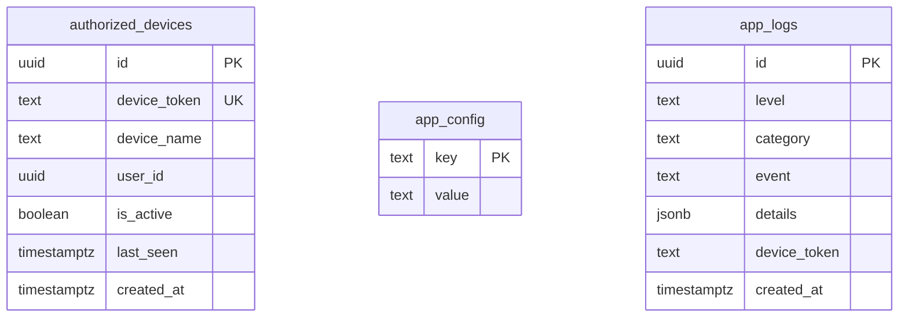
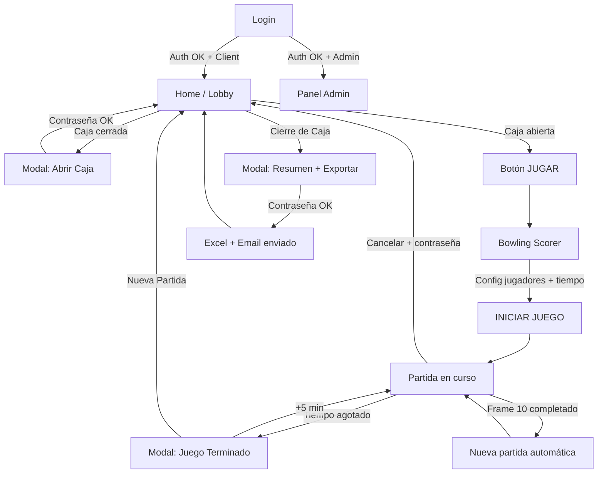

<p align="center">
  
</p>

<h1 align="center">🎳 La Bolera Universo</h1>

<p align="center">
  <strong>Sistema integral de gestión y puntuación para boleras</strong><br/>
  Aplicación web + escritorio construida con Angular 20, Electron, Supabase y Tailwind CSS
</p>

<p align="center">
  
  
  
  
  
</p>

---

## 📋 Índice

- [Descripción General](#-descripción-general)
- [Características](#-características)
- [Arquitectura del Proyecto](#-arquitectura-del-proyecto)
- [Stack Tecnológico](#-stack-tecnológico)
- [Estructura de Archivos](#-estructura-de-archivos)
- [Requisitos Previos](#-requisitos-previos)
- [Instalación](#-instalación)
- [Configuración de Entorno](#-configuración-de-entorno)
- [Ejecución](#-ejecución)
- [Build y Distribución](#-build-y-distribución)
- [Base de Datos (Supabase)](#-base-de-datos-supabase)
- [API Serverless (Vercel)](#-api-serverless-vercel)
- [Flujo de la Aplicación](#-flujo-de-la-aplicación)
- [Módulos y Componentes](#-módulos-y-componentes)
- [Servicios](#-servicios)
- [Seguridad](#-seguridad)
- [Autor](#-autor)

---

## 🎯 Descripción General

**La Bolera Universo** es un sistema completo de gestión operativa para boleras que combina:

1. **Marcador de bolos digital** — Puntuación en tiempo real con reglas oficiales de bowling (strikes, spares, frame 10 especial, partidas múltiples encadenadas).
2. **Control de tiempo** — Temporizador configurable por sesión con alertas automáticas, extensiones de tiempo protegidas por contraseña y finalización al completar la ronda de jugadores.
3. **Contabilidad diaria** — Apertura/cierre de caja, registro de sesiones, y exportación automática de reportes Excel con envío por correo electrónico.
4. **Panel de administración** — Gestión de dispositivos autorizados, control de acceso por roles y configuración remota.
5. **Modo kiosko** — Diseñado para operar como terminal exclusiva: bloquea recargas, cierre de ventanas y navegación accidental durante partidas activas.

La aplicación funciona tanto como **aplicación web** (desplegada en Vercel) como **aplicación de escritorio** (empaquetada con Electron para macOS, Windows y Linux).

---

## ✨ Características

### 🎳 Marcador de Bolos
- Puntuación oficial de 10 frames con cálculo automático de strikes, spares y bonificaciones
- Frame 10 con hasta 3 tiros según las reglas oficiales
- Soporte para **1 a 9 jugadores** simultáneos
- **Partidas encadenadas** automáticas — al completar 10 frames, los scores se acumulan y comienza una nueva partida
- **Edición de puntuación** inline con validación (corrección de errores sin romper el estado del juego)
- Navegación completa por **teclado** (teclas 0-9, X para strikes, flechas para navegar)
- Indicador visual del jugador activo y frame actual

### ⏱️ Gestión de Tiempo
- Selección de tiempo de juego (60 minutos por defecto, configurable)
- Temporizador regresivo con sincronización basada en `Date.now()` (resistente a cambios de pestaña)
- Alertas automáticas a los **15 minutos** y **5 minutos** restantes con auto-cierre
- Extensión de **+5 minutos** (compensación) y **+60 minutos** (extensión completa), ambas protegidas por contraseña de administrador
- Finalización suave: el juego termina al completar la ronda del frame actual cuando el tiempo llega a 0

### 📊 Contabilidad y Reportes
- Flujo de **apertura de caja** (requiere contraseña admin)
- Registro automático de cada sesión: hora inicio/fin, tiempo inicial, tiempo extra, estado (completada/cancelada)
- Resumen diario con métricas agregadas
- Exportación a **Excel (.xlsx)** local al cierre del día
- Envío automático del reporte por **correo electrónico** vía API serverless (Resend)
- Identificación por **pista/lane** en los reportes

### 🔐 Seguridad
- Autenticación con **Supabase Auth** (email + contraseña)
- Sistema de **roles**: `admin` y `client`
- **Autorización de dispositivos** con tokens únicos por navegador
- Límite configurable de dispositivos activos
- Bloqueo de recarga (F5, Ctrl+R), cierre (Ctrl+W) y navegación durante partidas activas
- Guards de ruta para proteger secciones admin y de juego
- Observabilidad: **logging centralizado** a Supabase con niveles (info/warn/error) y categorías

### 🖥️ Multiplataforma
- **Web app** con deploy automático en Vercel
- **App de escritorio** con Electron (macOS `.dmg`, Windows `.exe`/`.nsis`, Linux `.AppImage`/`.deb`)
- Resolución optimizada para pantallas de 1920×1080 (modo kiosko)
- Integración con Vercel Analytics y Speed Insights

---

## 🏗️ Arquitectura del Proyecto

```
┌──────────────────────────────────────────────────────────────┐
│                     FRONTEND (Angular 20)                    │
│  ┌──────────┐  ┌──────────────┐  ┌───────┐  ┌───────────┐  │
│  │  Login   │  │BowlingScorer │  │ Home  │  │   Admin   │  │
│  └────┬─────┘  └──────┬───────┘  └───┬───┘  └─────┬─────┘  │
│       │               │              │             │        │
│  ┌────┴───────────────┴──────────────┴─────────────┴────┐   │
│  │                    SERVICES LAYER                     │   │
│  │  AuthService · AccountingService · KeyboardNavService │   │
│  │  LoggingService · SupabaseService                     │   │
│  └────────────────────┬──────────────────────────────────┘   │
│                       │                                      │
│  ┌────────────────────┴──────────────────────────────────┐   │
│  │                   GUARDS LAYER                         │   │
│  │  authGuard · adminGuard · preventNavigationGuard       │   │
│  └────────────────────────────────────────────────────────┘   │
└───────────────────────────┬──────────────────────────────────┘
                            │
          ┌─────────────────┼─────────────────┐
          ▼                 ▼                  ▼
   ┌─────────────┐  ┌─────────────┐   ┌──────────────┐
   │  Supabase   │  │   Vercel    │   │   Electron   │
   │  Auth + DB  │  │ Serverless  │   │  (Desktop)   │
   │  + Logs     │  │  API Email  │   │              │
   └─────────────┘  └─────────────┘   └──────────────┘
```

---

## 🛠️ Stack Tecnológico

| Capa | Tecnología | Versión | Propósito |
|------|-----------|---------|-----------|
| **Frontend** | Angular | 20.3 | Framework SPA principal |
| **Estilos** | Tailwind CSS + DaisyUI | 4.x / 4.12 | Utilidades CSS y componentes |
| **Escritorio** | Electron | 40.x | Empaquetado como app nativa |
| **Auth & DB** | Supabase | 2.x | Autenticación, PostgreSQL, RLS |
| **API** | Vercel Serverless Functions | — | Envío de emails con Resend |
| **Email** | Resend | 6.x | Transactional emails |
| **Reportes** | SheetJS (xlsx) | 0.18 | Generación de archivos Excel |
| **Analytics** | Vercel Analytics + Speed Insights | 2.x | Métricas web |
| **Build** | electron-builder | 26.x | Empaquetado multiplataforma |
| **TypeScript** | — | 5.9 | Tipado estático |
| **RxJS** | — | 7.8 | Programación reactiva |

---

## 📁 Estructura de Archivos

```
LaBoleraUniverso/
├── api/                                # Serverless functions (Vercel)
│   ├── send-email.ts                   # Endpoint POST para envío de reportes por correo
│   └── tsconfig.json
│
├── src/
│   ├── app/
│   │   ├── admin/                      # Panel de administración de dispositivos
│   │   │   ├── admin.ts                # Component: CRUD de dispositivos + config
│   │   │   └── admin.html              # Template con tabla, stats y acciones
│   │   │
│   │   ├── bowling-scorer/             # ⭐ Marcador de bolos (componente principal)
│   │   │   └── bowling-scorer.ts       # ~1700 líneas: marcador, timer, modales, edición
│   │   │
│   │   ├── home/                       # Pantalla principal (lobby)
│   │   │   ├── home.ts                 # Lógica de apertura/cierre de caja
│   │   │   ├── home.html               # UI con logo, botón jugar, modales
│   │   │   └── home.css
│   │   │
│   │   ├── login/                      # Pantalla de autenticación
│   │   │   ├── login.ts                # Login + registro de dispositivos nuevos
│   │   │   └── login.html
│   │   │
│   │   ├── errors/
│   │   │   └── global-error-handler.ts # Handler global de errores → LoggingService
│   │   │
│   │   ├── guards/
│   │   │   ├── auth-guard.ts           # Protección de rutas autenticadas
│   │   │   └── admin-guard.ts          # Protección de rutas admin
│   │   │
│   │   ├── models/
│   │   │   └── accounting.models.ts    # Interfaces: GameSession, DailySummary
│   │   │
│   │   ├── services/
│   │   │   ├── supabase.ts             # Cliente Supabase singleton
│   │   │   ├── auth.service.ts         # Auth: login, sesión, dispositivos, roles
│   │   │   ├── accounting.service.ts   # Contabilidad: sesiones, cierre, Excel, email
│   │   │   ├── keyboard-nav.service.ts # Navegación por teclado con scopes
│   │   │   └── logging.service.ts      # Logging centralizado a Supabase
│   │   │
│   │   ├── app.ts                      # Componente raíz
│   │   ├── app.html                    # Template raíz (<router-outlet>)
│   │   ├── app.routes.ts               # Definición de rutas
│   │   ├── app.config.ts               # Providers globales
│   │   └── prevent-navigation.guard.ts # Guard canDeactivate para el scorer
│   │
│   ├── assets/
│   │   ├── icons/                      # Logos e íconos (.png, .ico, .icns)
│   │   ├── images/                     # Fondo e imágenes decorativas
│   │   └── fonts/                      # Fuentes personalizadas
│   │
│   ├── environments/
│   │   ├── environment.ts              # Config producción (Supabase URL + key)
│   │   └── environment.development.ts  # Config desarrollo
│   │
│   ├── index.html                      # HTML raíz + scripts Vercel
│   ├── main.ts                         # Bootstrap Angular
│   └── styles.css                      # Estilos globales + Tailwind
│
├── supabase/
│   └── migrations/
│       └── create_app_logs.sql         # Tabla app_logs + RLS + índices
│
├── main.js                             # Entry point de Electron
├── angular.json                        # Config Angular CLI
├── package.json                        # Dependencias y scripts
├── tsconfig.json                       # Config TypeScript base
├── .env                                # Variables de entorno (no versionado)
└── .gitignore
```

---

## 📦 Requisitos Previos

- **Node.js** ≥ 20.x
- **npm** ≥ 10.x
- Cuenta en [Supabase](https://supabase.com/) (para auth y base de datos)
- Cuenta en [Vercel](https://vercel.com/) (para deploy web y API serverless)
- Cuenta en [Resend](https://resend.com/) (para envío de emails transaccionales)

---

## 🚀 Instalación

```bash
# Clonar el repositorio
git clone https://github.com/DevNico2905/LaBoleraUniverso.git
cd LaBoleraUniverso

# Instalar dependencias
npm install
```

---

## ⚙️ Configuración de Entorno

### 1. Variables de entorno (`.env`)

Crear un archivo `.env` en la raíz del proyecto:

```env
RESEND_API_KEY=re_xxx...                    # API key de Resend
REPORT_EMAIL=destinatario@ejemplo.com       # Email(s) para reportes (separar con comas)
BCC_EMAIL=copia-oculta@ejemplo.com          # Email(s) BCC opcionales
FROM_EMAIL=bolera@tudominio.com             # Remitente (debe estar verificado en Resend)
```

> ⚠️ Las variables de `.env` se usan exclusivamente en la función serverless de Vercel. Deben configurarse también en el dashboard de Vercel como **Environment Variables**.

### 2. Configuración de Supabase (`src/environments/`)

Crear los archivos de entorno Angular:

```typescript
// src/environments/environment.ts (producción)
export const environment = {
  production: true,
  supabaseUrl: 'https://TU_PROYECTO.supabase.co',
  supabaseKey: 'tu_anon_key_publica',
};
```

```typescript
// src/environments/environment.development.ts
export const environment = {
  production: false,
  supabaseUrl: 'https://TU_PROYECTO.supabase.co',
  supabaseKey: 'tu_anon_key_publica',
};
```

### 3. Tablas de Supabase

La aplicación requiere las siguientes tablas en tu proyecto Supabase:

| Tabla | Propósito |
|-------|-----------|
| `authorized_devices` | Registro de dispositivos cliente autorizados |
| `app_config` | Configuración clave-valor (ej: `max_devices`) |
| `app_logs` | Logs centralizados de la aplicación |

Ejecuta la migración SQL en el SQL Editor de Supabase:

```sql
-- Ver: supabase/migrations/create_app_logs.sql
```

La tabla `authorized_devices` debe tener al menos las columnas:
```
id (uuid, PK), device_token (text, UNIQUE), device_name (text),
user_id (uuid), is_active (boolean, default true),
last_seen (timestamptz), created_at (timestamptz)
```

La tabla `app_config` debe tener:
```
key (text, PK), value (text)
```
Con al menos un registro: `key = 'max_devices'`, `value = '6'`.

---

## 🖥️ Ejecución

### Modo desarrollo (web)

```bash
npm start
# o
ng serve
```

Abre http://localhost:4200 en tu navegador.

### Modo Electron (escritorio)

```bash
# Build de Angular + launch Electron
npm run electron:dev
```

### Solo Electron (si ya tienes un build)

```bash
npm run electron
```

---

## 📦 Build y Distribución

### Build web (producción)

```bash
npm run build
```

El output se genera en `dist/bolera/browser/`.

### Build Electron + empaquetado

```bash
# Empaquetar para macOS
npm run dist:mac

# Empaquetar para Windows
npm run dist:win

# Empaquetar para todas las plataformas
npm run dist:all
```

Los instaladores se generan en la carpeta `release/`.

| Plataforma | Formatos generados |
|------------|--------------------|
| macOS | `.dmg`, `.zip` |
| Windows | `.exe` (NSIS installer), portable (x64 & arm64) |
| Linux | `.AppImage`, `.deb` |

### Deploy web (Vercel)

El proyecto está configurado para deploy automático en Vercel. La función serverless `api/send-email.ts` se despliega automáticamente como un endpoint API.

---

## 🗄️ Base de Datos (Supabase)

### Tablas principales



### Row Level Security (RLS)

- **`app_logs`**: Usuarios autenticados pueden insertar. Solo admins pueden leer.
- **`authorized_devices`**: Controlada por políticas para lectura/escritura según rol.

---

## 📧 API Serverless (Vercel)

### `POST /api/send-email`

Envía el reporte de cierre de caja por correo electrónico usando Resend.

**Request body:**
```json
{
  "date": "2026-03-30",
  "totalGames": 12,
  "filename": "Informe Pista 1 2026-03-30.xlsx",
  "laneName": "1",
  "excelBase64": "UEsDBBQAAAAIAB..."
}
```

**Respuesta exitosa:** `200 { "success": true, "data": {...} }`

**Características:**
- CORS habilitado para peticiones desde `file://` (Electron) y cualquier origen web
- Soporte para múltiples destinatarios y BCC
- Template HTML responsive con métricas y archivo Excel adjunto

---

## 🔄 Flujo de la Aplicación



---

## 🧩 Módulos y Componentes

### `LoginComponent` — `/login`
- Formulario de autenticación (email + contraseña)
- Detección automática de dispositivos nuevos → solicita nombre para registro
- Redirección según rol: admin → `/admin`, client → `/`

### `HomeComponent` — `/` (protegido por `authGuard`)
- Pantalla de lobby con logo a pantalla completa
- Botón **"JUGAR"** (solo visible si la caja está abierta)
- Botón **"ABRIR CAJA"** (protegido por contraseña admin)
- FAB de **"Cierre de Caja"** → resumen del día + exportación Excel + envío email

### `BowlingScorerComponent` — `/game` (protegido por `authGuard` + `preventNavigationGuard`)
- Tabla de puntuación responsive con indicador del jugador activo
- Input por teclado (0-9, X) con validación automática de pines disponibles
- Timer con alertas y opciones de extensión de tiempo
- Modo edición inline para corregir errores en tiros pasados
- Gestión de jugadores mid-game (agregar/quitar)
- Cancelación de partida con contraseña

### `AdminComponent` — `/admin` (protegido por `adminGuard`)
- Dashboard con estadísticas de dispositivos (activos, totales, límite)
- Tabla CRUD de dispositivos: activar, revocar, renombrar, eliminar
- Configuración del límite máximo de dispositivos

---

## ⚙️ Servicios

### `AuthService`
- Login/logout con Supabase Auth
- Restauración de sesión al recargar
- Gestión de dispositivos autorizados (registro, validación, token UUID)
- Verificación de contraseña para acciones protegidas
- Roles: `admin` | `client`

### `AccountingService`
- Apertura/cierre del día operativo
- Registro de sesiones de juego (`startGame` / `endGame`)
- Persistencia en `localStorage` para resistir recargas
- Generación de Excel con SheetJS
- Envío del reporte por email via API serverless

### `KeyboardNavService`
- Navegación con flechas entre elementos `.kb-focusable`
- Sistema de **scopes** para modales (restringe navegación al modal activo)
- Activación con Enter, auto-scroll al elemento enfocado

### `LoggingService`
- Logging estructurado con niveles (`info`, `warn`, `error`) y categorías (`auth`, `game`, `accounting`, `system`)
- Persistencia en tabla `app_logs` de Supabase
- Incluye `device_token` para trazabilidad
- Fallback a `console.*` para debugging local

### `SupabaseService`
- Singleton que expone el cliente de Supabase configurado con las credenciales del entorno

---

## 🔒 Seguridad

| Capa | Mecanismo |
|------|-----------|
| **Autenticación** | Supabase Auth (email/password) |
| **Autorización de dispositivos** | Token UUID único por navegador almacenado en `localStorage` |
| **Límite de dispositivos** | Configurable desde el panel admin (`app_config.max_devices`) |
| **Roles** | `admin` (acceso completo) / `client` (requiere dispositivo autorizado) |
| **Protección de rutas** | `authGuard` (sesión válida), `adminGuard` (sesión + rol admin) |
| **Anti-recarga** | `beforeunload`, `HostListener` bloqueando F5/Ctrl+R/Ctrl+W durante partidas |
| **Anti-navegación** | `canDeactivate` guard con confirmación en juegos activos |
| **Acciones sensibles** | Contraseña requerida para: abrir caja, cerrar caja, cancelar partida, extender tiempo |
| **Row Level Security** | Políticas RLS en Supabase para `app_logs` y `authorized_devices` |
| **Error Handling** | `GlobalErrorHandler` captura errores no manejados y los registra en Supabase |

---

## 👤 Autor

**Nicolás Bernal R.**

- GitHub: [@DevNico2905](https://github.com/DevNico2905)

---

<p align="center">
  <em>Hecho con ❤️ para La Bolera Universo</em>
</p>
